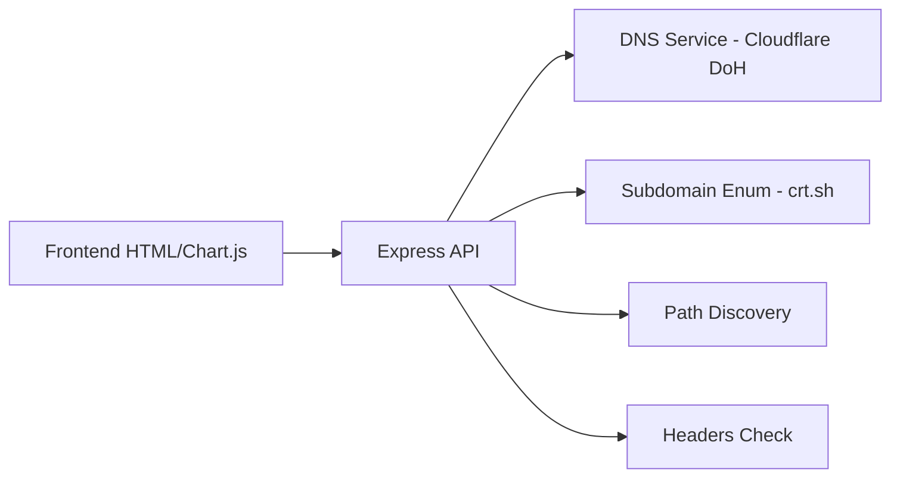

# ShieldScan — Domain Security Auditor

Herramienta OSINT de auditoría de seguridad web. Escanea dominios en busca de subdominios, rutas críticas, cabeceras de seguridad y genera un puntaje de riesgo dinámico.

## Arquitectura



## Endpoints

| Ruta | Método | Descripción |
|---|---|---|
| `/api/scan` | POST | Escaneo completo de dominio |

## Servicios Internos

| Servicio | Función |
|---|---|
| `dns.service.js` | Resolución DNS vía Cloudflare DoH |
| `safebrowsing.service.js` | ASN lookup con HackerTarget |
| `virustotal.service.js` | *(simulado)* |

## Scoring de Riesgo

| Hallazgo | Peso |
|---|---|
| `.env` / `.git` expuesto | 99% |
| Cabeceras de seguridad ausentes | Alto |
| Subdominios sin protección | Medio |

## Inicio Rápido

```bash
npm install
npm run dev
```

Visitar: http://localhost:3000

---

**Tecnologías:** Node.js, Express 5, Chart.js, Tailwind CSS, Morgan
